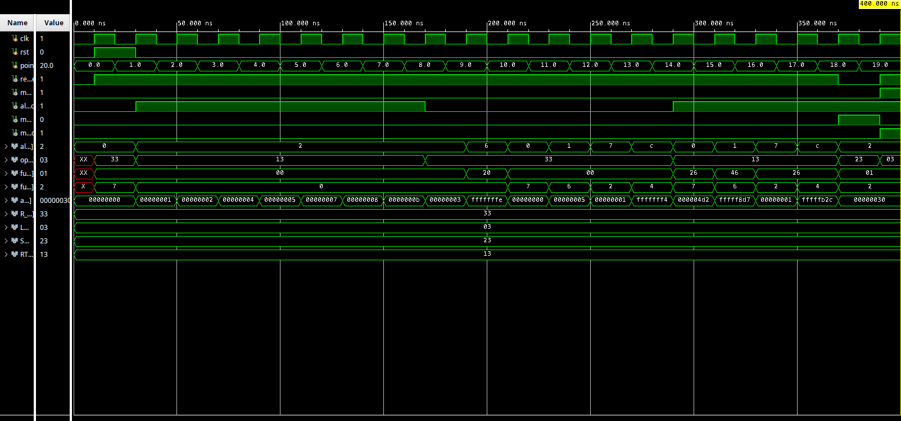

# RISC-V Datapath

Complete single-cycle RISC-V processor datapath in Verilog. Integrates program counter, instruction memory, register file, ALU, data memory, and control signals to execute RISC-V programs.

## Architecture

```
┌─────────┐    ┌──────────────┐    ┌──────────┐    ┌─────┐    ┌──────────┐
│   PC    │──▶│ Instruction  │──▶│ Register │──▶│ ALU │──▶│   Data   │
│ Register│    │   Memory     │    │   File   │    │     │    │  Memory  │
└─────────┘    └──────────────┘    └──────────┘    └─────┘    └──────────┘
     ▲               │                   ▲            │            │
     │               │                   │            │            │
     └───────────────┴───────────────────┴────────────┴────────────┘
                              Control Signals
```

## Components

### Program Counter
- 8-bit D Flip-Flop with synchronous reset
- Increments by 4 each cycle
- Holds current instruction address

### Instruction Memory
- 64×32 instruction memory (20 pre-loaded instructions)
- Byte-addressable with word alignment
- Combinational read

### Register File
- 32×32 register array
- Dual-port read (asynchronous)
- Single-port write (synchronous)
- Register 0 hardwired to zero

### Immediate Generator
- Sign-extends immediate values from instructions
- Supports I-type and S-type formats

### ALU
- 32-bit arithmetic logic unit
- Supports ADD, SUB, AND, OR, NOR, SLT, EQ
- 4-bit control code input
- Generates zero, overflow, and carry flags

### 2:1 Multiplexers (32-bit)
- **ALU Source MUX**: Selects register data or immediate
- **Writeback MUX**: Selects ALU result or memory data

### Data Memory
- 128×32 data memory (512 bytes)
- Byte-addressable with word alignment
- Synchronous write (clocked), combinational read
- Separate read/write enables

## Features

- **Single-Cycle Execution** — One instruction per clock cycle
- **Parameterized Design** — Configurable bit widths
- **Memory Operations** — Load word (LW) and store word (SW) support
- **Zero Register Protection** — Register 0 always reads zero
- **Word-Aligned Memory** — Automatic alignment for instruction and data access

## Supported Instructions

| Type | Instructions |
|------|-------------|
| **R-type** | `add`, `sub`, `and`, `or`, `nor`, `slt` |
| **I-type** | `addi`, `andi`, `ori`, `nori`, `slti` |
| **Load** | `lw` |
| **Store** | `sw` |

## Control Signals

| Signal | Width | Description |
|--------|-------|-------------|
| `reg_write` | 1 | Enable writing to register file |
| `mem2reg` | 1 | Select memory data for writeback |
| `alu_src` | 1 | Select immediate as ALU operand |
| `mem_write` | 1 | Enable data memory write |
| `mem_read` | 1 | Enable data memory read |
| `alu_cc` | 4 | ALU operation control code |

## Test Program

Instruction memory pre-loaded with 20-instruction RISC-V test program:

| Index | Assembly | Expected ALU Result |
|-------|----------|---------------------|
| 0 | `and r0, r0, r0` | `0x00000000` |
| 1 | `addi r1, r0, 1` | `0x00000001` |
| 2 | `addi r2, r0, 2` | `0x00000002` |
| 3 | `addi r3, r1, 3` | `0x00000004` |
| 4 | `addi r4, r1, 4` | `0x00000005` |
| 5 | `addi r5, r2, 5` | `0x00000007` |
| 6 | `addi r6, r2, 6` | `0x00000008` |
| 7 | `addi r7, r3, 7` | `0x0000000B` |
| 8 | `add r8, r1, r2` | `0x00000003` |
| 9 | `sub r9, r8, r4` | `0xFFFFFFFE` |
| 10 | `and r10, r2, r3` | `0x00000000` |
| 11 | `or r11, r3, r4` | `0x00000005` |
| 12 | `slt r12, r3, r4` | `0x00000001` |
| 13 | `nor r13, r6, r7` | `0xFFFFFFF4` |
| 14 | `andi r14, r9, 0x4D3` | `0x000004D2` |
| 15 | `ori r15, r11, 0x8D3` | `0xFFFFF8D7` |
| 16 | `slti r16, r13, 0x4D2` | `0x00000001` |
| 17 | `nori r17, r8, 0x4D2` | `0xFFFFFB2C` |
| 18 | `sw r11, 48(r0)` | `0x00000030` |
| 19 | `lw r12, 48(r0)` | `0x00000030` |

Instructions 18-19 demonstrate memory operations: store r11 (0x00000005) to address 48, then load back into r12.

## Simulation Waveform



## Files

### Design Sources
- `pc_reg.v` — Program counter register
- `inst_mem.v` — Instruction memory
- `reg_file.v` — Register file
- `imm_gen.v` — Immediate generator
- `alu_32.v` — 32-bit ALU
- `mux_32.v` — 32-bit 2:1 multiplexer
- `data_mem.v` — Data memory
- `data_path.v` — Top-level datapath

### Testbenches
- `dp_tb_top.v` — Datapath testbench with control signal generation

## Simulation

Run using Vivado or any Verilog simulator.

### Clock & Verification
- 20 ns clock period (50 MHz)
- Testbench auto-generates control signals from instruction fields
- Verifies ALU output and memory operations for all 20 instructions
- Scoring: `The number of correct test cases is: 20.0`

### Key Signals to Monitor
- `pc_out` — Program counter
- `instruction` — Current instruction
- `alu_out` — ALU result
- `rg_rd_data1`, `rg_rd_data2` — Register outputs
- `dm_read_data` — Data memory output
